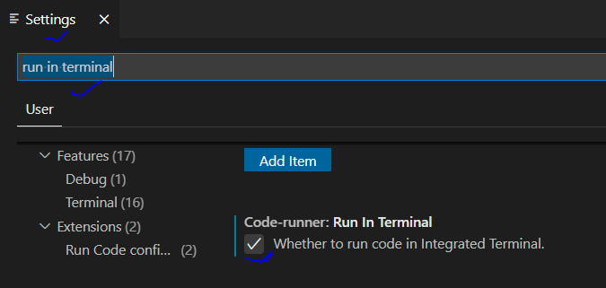
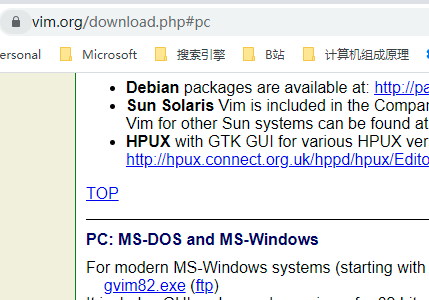

## C Environment

### Setting Environment 1 

 [Setting C Environment](https://www.bilibili.com/video/BV1nt4y1r7Ez?from=search&seid=18256261428586168705)

1. Download MinGW：https://bit.ly/mingw10   => mingw-17.1-without-git.exe 

2. 设置GCC环境变量 C:\MinGW\bin

3. CMD 检查： g++ --version

4. VS install **Code Runner** and **c/c++**

   1. Code Runner: Ctrl + Alt + N  start
   2. Ctrl + Alt + M stop

5. Setting for Code runner to Read Console

   

### Setting Environment 2

Linux, 执行sudo apt-get update,安装gcc; g++ helloworld.c; ./a.out

- [ ] https://www.bilibili.com/video/BV17s411N78s 甲鱼课程

- [ ] https://www.bilibili.com/video/BV1ic411h7pu?spm_id_from=333.788.b_636f6d6d656e74.10 甲鱼师妹推荐

## Vim

### installation, Setup and Model

[Editing With vim 01 - Installation, Setup, and The Modes](https://www.youtube.com/watch?v=5givLEMcINQ&list=PL13bz4SHGmRxlZVmWQ9DvXo1fEg4UdGkr&index=3)

1. [download windows vim](http://www.vim.org/download.php)

2. 安装，（包含exe的folder）且设置environment 下path
3. CMD可以使用，GUI也可以使用

### Vim adventure

[游戏中文讲解](https://blog.csdn.net/weixin_45107866/article/details/93711288)

[VIM 的冒险之旅](http://vim-adventures.com/)

购买 https://www.douban.com/group/topic/212135737/

### 